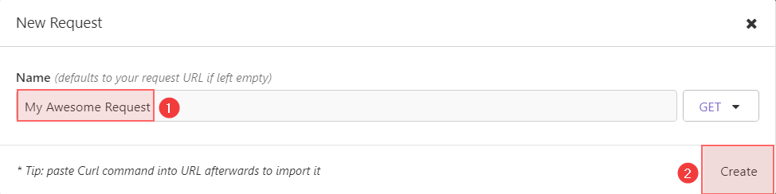
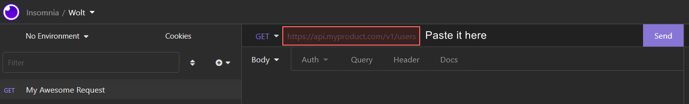

## Summary

- [About](#about)
- [Build and run](#build-and-run)
    - [Build](#build)
    - [Test](#test)
    - [Run](#run)
    - [Logging](#logging)
- [Request the data](#request-the-data)
- [Technologies](#technologies)
- [Feedback](#feedback)

## About

The service is used to convert the restaurant's raw business hours in JSON format into a human-readable format. It
currently contains only one controller and one method to work with, but it can be extended as needed.

## Build and run

### Build

Service uses Java 11, so make sure to install it first.
You can download it here: [Adoptium](https://adoptium.net/temurin/archive). Please choose OpenJDK 11 as a version
and download and install a package, related to your system.

To **build** a service you should run the next command from the source root folder:

```
gradlew build
```

Build task basically contain all the related tasks such as `compileKotlin`, `test`, etc. So there is no need to run any
other specific command.

### Test

To run the **tests** for the service you should execute the next command from the source root folder:

```
gradlew test
```

### Run

To run the service you should execute the next command from the source root folder:

```
gradlew bootRun
```

Once launched, the application will be available at the following address: `http://localhost:8080`

### Logging

The service has trace logs to check the steps.
To enable the display of trace logs, you need to set
a property
```
logging.level.ru.stxima.openinghoursweb=TRACE
```
in the `resources/application.properties` properties file.

## Request the data

To see how it works, you can use software, such as [Insomnia](https://insomnia.rest/download)
to make requests to the application or simply use `bash` with `curl`.

**Example request:**

```
curl --request POST \
  --url http://localhost:8080/openinghours \
  --header 'Content-Type: application/json' \
  --data '{
    "data": {
        "monday": [],
        "tuesday": [
            {
                "type": "open",
                "value": 36000
            },
            {
                "type": "close",
                "value": 64800
            }
        ],
        "wednesday": [],
        "thursday": [
            {
                "type": "open",
                "value": 37800
            },
            {
                "type": "close",
                "value": 64800
            }
        ],
        "friday": [
            {
                "type": "open",
                "value": 36000
            }
        ],
        "saturday": [
            {
                "type": "close",
                "value": 3600
            },
            {
                "type": "open",
                "value": 36000
            }
        ],
        "sunday": [
            {
                "type": "close",
                "value": 3600
            },
            {
                "type": "open",
                "value": 43200
            },
            {
                "type": "close",
                "value": 75600
            }
        ]
    }
}'
```

If you want to import this request to the Insomnia, please, follow the next steps:

- First, download and install [Insomnia](https://insomnia.rest/download);
- From the main application window please press `Ctrl + N`;
- Give a name to your request, e.g.: `My Awesome Request`;
- Click `Create` at the Right Bottom corner of the `New Request` popup;
  
- Copy the `curl` command above and paste it into the `URL` text field;
  
- With running service click `Send` button and see what happens!

## Technologies

- The service written using [Kotlin](https://kotlinlang.org/) programming language.
- [Spring Framework](https://spring.io/projects/spring-framework) as a server-side framework.
- As a template engine [Mustache](http://mustache.github.io/) is used.
- Tests were implemented using [JUnit 5](https://junit.org/junit5/) testing framework.
- Builds are managed by [Gradle](https://gradle.org/) build tool.

## Feedback

First, thank you for the opportunity to work with such an interesting assignment. It was very interesting to think
logically about its implementation.

### Few words about the request data structure

I would rather use the next data structure:

```json
{
  "monday": [
    {
      "opensAt": 3600,
      "closesAt": 7200
    },
    {
      "opensAt": 37800,
      "closesAt": 64800
    }
  ],
  "friday": [
    {
      "opensAt": 36000,
      "closesAt": 3600
    }
  ]
}
```

Instead of:

```json
{
  "monday": [
    {
      "type": "open",
      "value": 3600
    },
    {
      "type": "close",
      "value": 7200
    },
    {
      "type": "open",
      "value": 37800
    },
    {
      "type": "close",
      "value": 64800
    }
  ],
  "friday": [
    {
      "type": "open",
      "value": 36000
    }
  ],
  "saturday": [
    {
      "type": "close",
      "value": 3600
    }
  ]
}
```

For the reason that, in fact, to display the correct data, we do not need to know the time intervals,
we only need to know the specific hours when the restaurant was open and when it will be closed.
And, if the format proposed above were used, then less code and logic would be required to implement the service.

### Some other comments related to the implementation

**Response view model:**

I have used little different response view model. It seemed to me more visual display of all days not included in the
request, as a `Closed`. If there is no need to display them, they could be removed easily from the code.

**Request model:**

I wrapped the original request with the `GetHumanReadableOpeningHoursFromRawDataRequest` view model
to make it more specific than just

```kotlin
Map<DayOfWeek, List<OpeningHoursRequest>>
```

But if there is no need for it, then it could be easily removed as well.